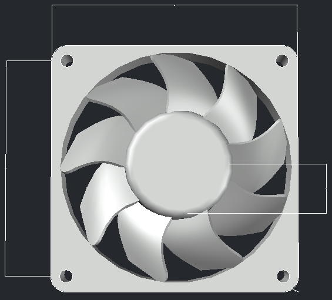
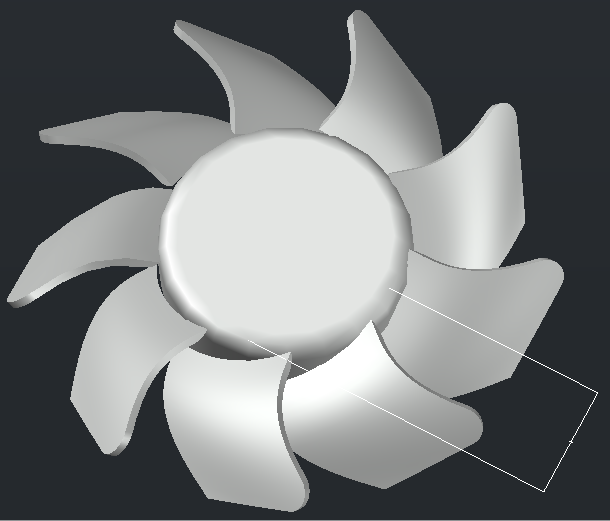
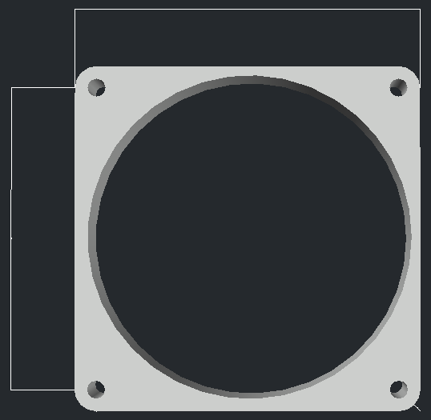
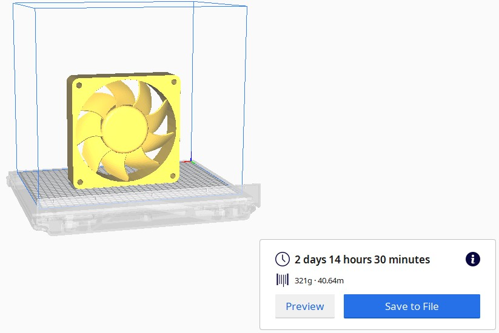
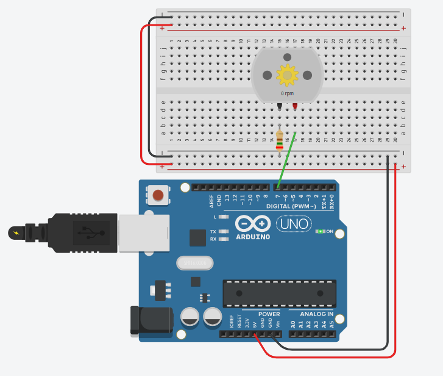
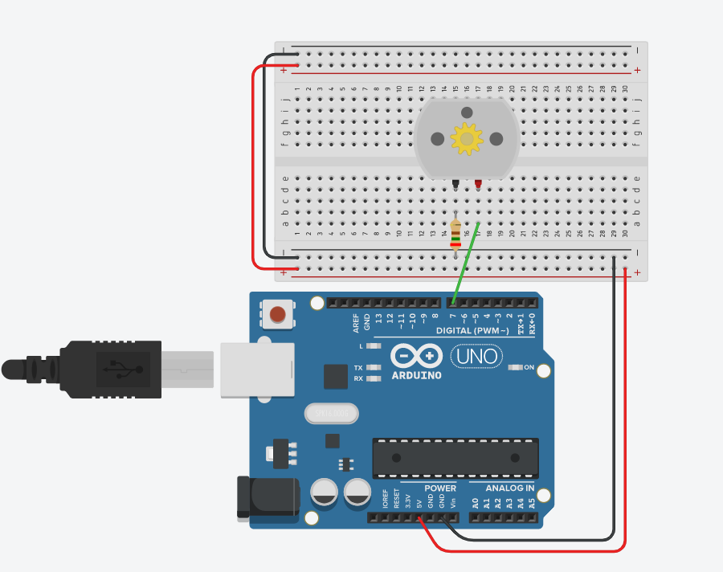

# Pc-Fan

### Team Members

- Asel Esra Ozyilmaz
- Selma Nezihoglu
- Gunduzalp Dogrutekin
- Osman Yasir Ozyilmaz

## Project Description

We have created a pc fan for active cooling. Fans are used to draw cooler air into the case from the outside, expel warm air from inside and move air across a heat sink to cool a particular component.
Our fan consists of two parts; inner part & outer part = **Fan & Case**
We have used **AutoCad** for the design of our fan and **Tinkercad** for our circuit.

Thingiverse link: https://www.thingiverse.com/thing:4359206

### Design with Dimensions;

  

### Cura Secreenshot;

### Circuit & Parts List

 

